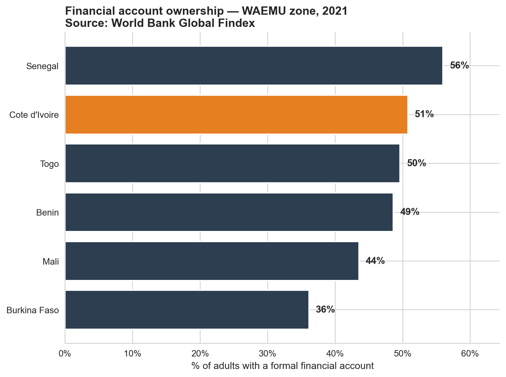
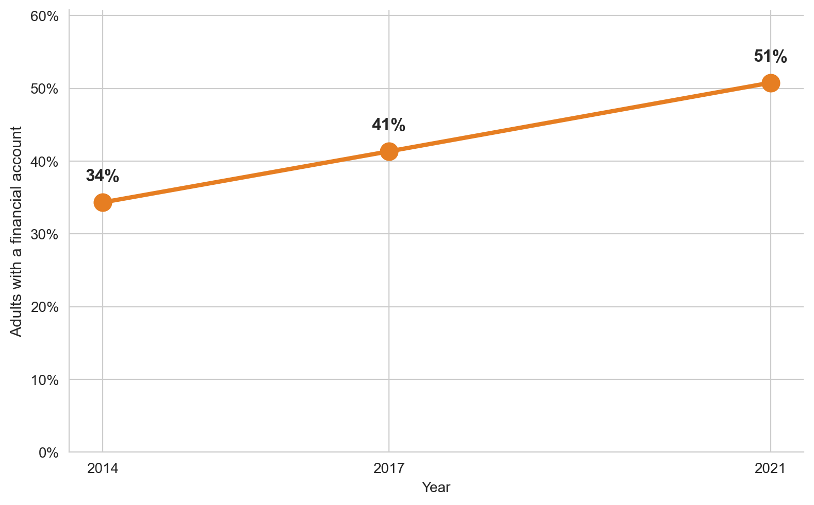
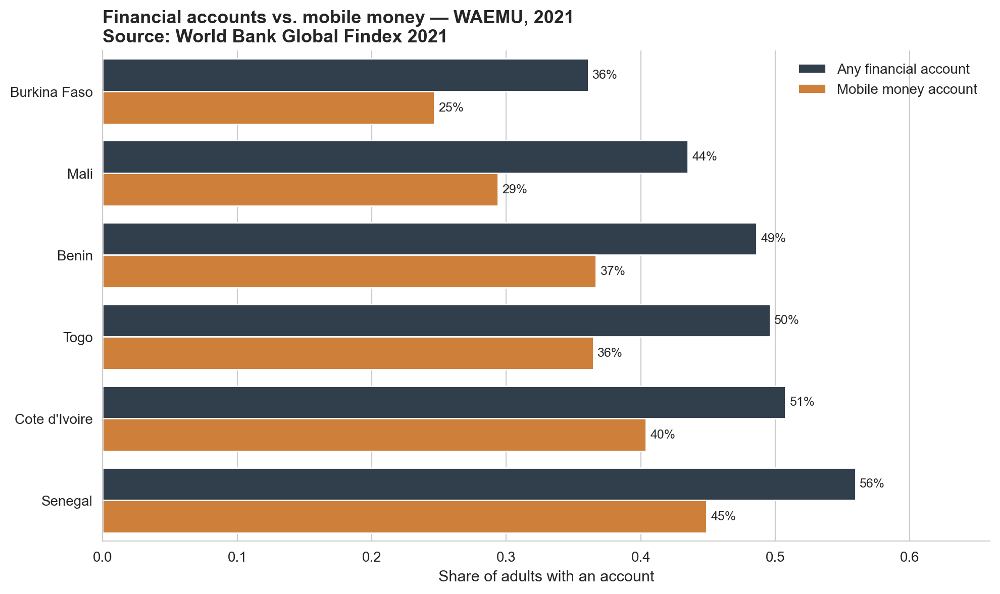

# Financial Inclusion in Côte d'Ivoire — WAEMU Zone Analysis

> **In 2021, 51% of Ivorian adults held at least one account with a financial institution or a mobile money provider.
> This project explores what that number really means — in regional context,
> over time, and through the lens of mobile money.**

Data source: [World Bank Global Findex Database 2021](https://thedocs.worldbank.org/en/doc/6fa0abd1f7f266f7115adae07278eb97-0050062022/global-findex-2021-country-level-data-excel-file)

## 🎯 Motivation

Financial inclusion is a key development issue in West Africa, particularly
as mobile money continues to reshape access to financial services.

This project examines Côte d'Ivoire within its regional WAEMU context,
combining a local perspective with internationally comparable Global Findex data.

## 📊 Key findings

### 1. Côte d'Ivoire in the WAEMU regional context



In 2021, account ownership in Côte d'Ivoire reached **51%**.

Among the **6 WAEMU countries with available data**, Côte d'Ivoire ranked
**2**. Senegal recorded the highest rate at **56%**, while
Burkina recorded the lowest at **36%**.

*Niger and Guinea-Bissau are excluded from the 2021 comparison because data for this indicator is unavailable in the dataset.*

### 2. Strong growth between 2014 and 2021



Account ownership in Côte d'Ivoire increased from **34% in 2014**
to **51% in 2021**, a rise of approximately **17 percentage points**.

The data shows sustained progress across the available Global Findex survey years.

### 3. Mobile money plays a major role



In 2021, **40% of adults in Côte d'Ivoire owned a mobile money account**. Mobile Money thus accounted for nearly 78% of financial account holders overall. In other words, **out of ten Ivorian adults with at least one financial account, about eight used Mobile Money.**

The comparison highlights the importance of mobile-based financial services
in Côte d'Ivoire and across the WAEMU region.

---

## 🔧 Reproducing this analysis

1. Clone this repository:
```bash
   git clone https://github.com/hamedsaidd/financial-inclusion-cote-divoire.git
   cd financial-inclusion-cote-divoire
```
2. Install dependencies:
```bash
   pip install -r requirements.txt
```
3. Run the notebook:
```bash
   jupyter notebook notebooks/analysis.ipynb
```

---
## 📁 Repository structure

```
financial-inclusion-cote-divoire/
├── data/
│   └── globalfindex-database-2021.xlsx   # World Bank Global Findex 2021 data
├── notebooks/
│   └── analysis.ipynb                    # Main analysis notebook
├── output/
│   ├── 01_waemu_comparison.png
│   ├── 02_ci_evolution.png
│   └── 03_mobile_money_role.png
├── .gitignore 
├── LICENSE 
├── README.md
└── requirements.txt
```
---

## ⚠️ Limitations

This is a first exploratory analysis. Key limitations include:

- Global Findex indicators are based on survey responses and may be subject
  to self-reporting and sampling limitations.
- The analysis relies mainly on country-level aggregates.
- Niger and Guinea-Bissau are excluded from the 2021 WAEMU account-ownership comparison because data for this indicator is unavailable in the dataset.
- Gender, age, income and rural/urban differences are not yet explored.
- The analysis is descriptive and does not establish causal relationships.

## 🚀 Next steps

- Disaggregate financial inclusion by gender, age, income and rural/urban status.
- Cross-reference Global Findex results with BCEAO financial inclusion and
  mobile money statistics.
- Build an interactive Streamlit dashboard.
- Compare WAEMU outcomes with other African regions such as the East African
  Community.

--- 

  ## 👤 About

I'm **Hamed Diomandé**, a Data Analyst with a Master's degree in Mathematics
and Statistics from the University of Ottawa.

My interests include financial inclusion, economic development and the use
of data to better understand development challenges in West Africa.

- 🔗 LinkedIn: [Hamed Diomandé](https://www.linkedin.com/in/hamed-diomande-774079160/)

*Feedback and issues welcome — feel free to open an issue or reach out on LinkedIn.*

## 📄 License

MIT License — see [LICENSE](LICENSE) for details.

Global Findex data © World Bank, used under their [terms of use](https://www.worldbank.org/en/about/legal/terms-of-use-for-datasets).
